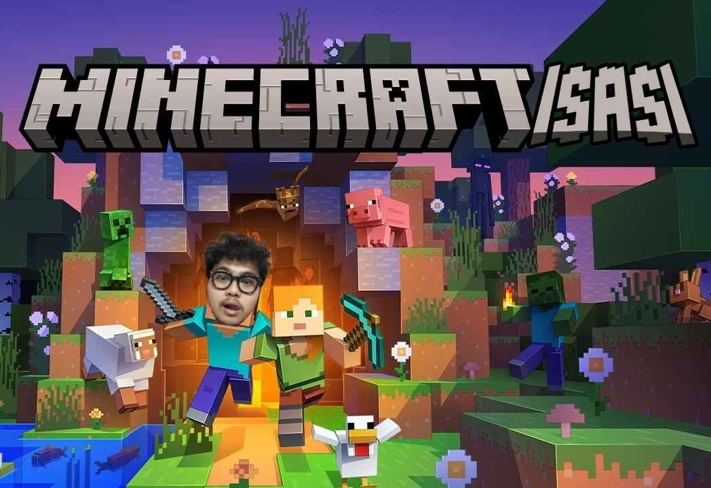

# Minecraftisasi - Tugas Kecil 2 Strategi Algoritma IF2211

## **Sebuah program Voxelator dengan OBJ Viewer oleh Arghawisesa Dwinanda Arham - 13524100**



### About

Program ini adalah aplikasi CLI yang mengimplementasikan algoritma **Divide and Conquer** dengan struktur data **Octree** untuk melakukan proses _voxelization_ pada model 3D berformat `.obj`. Melalui struktur _Octree_, batas _bounding box_ dari model 3D akan dipotong secara rekursif menjadi oktan yang lebih kecil hingga mencapai kedalaman maksimum yang ditentukan oleh pengguna. Hasil konversinya diekspor sebagai file `.obj` baru yang seluruhnya tersusun atas kubus-kubus voxel berukuran seragam.

Sebagai tambahan, program ini juga dilengkapi dengan bonus **OBJ Viewer**, sebuah aplikasi GUI untuk menampilkan model 3D, khususnya yang dihasilkan dari konversi program ini. _Viewer_ ini dilengkapi _rendering engine_ berbasis rasterisasi _z-buffer_, serta navigasi kamera zoom dan rotate. Kemudian program ini juga mengimplementasikan **Concurrency**. Concurrency diimplementasikan menggunakan ForkJoinPool dari Java, di mana saat sebuah node Octree dibagi menjadi 8 oktan, proses rekursi pada kedelapan oktan tersebut dijalankan secara paralel oleh thread-thread yang berbeda secara bersamaan, sehingga mempercepat pembangunan tree dibandingkan memproses satu per satu secara sekuensial.

#### Requirement Program

- **Java Development Kit (JDK)**: Minimal JDK 8+ (pembuatan program ini dilakukan dengan JDK 25 pada laptop author).

#### How to Compile

Untuk mengkompilasi _source code_ utama CLI maupun Viewer, buka terminal/Command Prompt di _root directory_ proyek (`Tucil2_13524100`) dan susun hasil _compile_ ke dalam _folder_ `bin`:

1. Buat folder `bin` (opsional, `javac -d` umumnya akan otomatis membuat direktori bila belum ada di beberapa OS, namun disarankan):

   ```bash
   mkdir -p bin
   ```

2. Kompilasi kelas utama (CLI Voxelator dan Viewer GUI):
   ```bash
   javac -d bin -sourcepath src src/Main.java
   javac -d bin -sourcepath src src/ViewerMain.java
   ```

#### How to Run and Use

#### 1. Menjalankan Program Utama

Untuk menjalankan program _voxelization_, jalankan perintah berikut:

```bash
java -cp bin Main
```

**Langkah penggunaan CLI**:

1. Saat program meminta "Input path file obj:", masukkan path menuju file target yang berformat `.obj` (contoh: `model/cube.obj`).
2. Saat program meminta "Input max depth:", masukkan bilangan bulat positif yang menjadi level batas kedalaman (contoh: `4`).
3. Tunggu hingga pemrosesan rekursif selesai.
4. Hasil konversi serta statistiknya (seperti waktu komputasi, jumlah vertice/faces, dst.) akan di-print pada CLI, dan model yang sudah mengalami _voxelization_ dapat ditemukan satu direktori dengan file aslinya dengan akhiran `-voxelized.obj`.

##### 2. Menjalankan GUI OBJ Viewer

Untuk menjalankan GUI 3D Viewer interaktif dari _scratch_, gunakan perintah:

```bash
java -cp bin ViewerMain
```

**Langkah penggunaan Viewer**:

1. Klik tombol **"Buka File .obj"** yang ada pada menu atas.
2. Pilih file hasil `*.-voxelized.obj` (tidak harus yang telah ter voxelized, jika ingin membuka .obj sebelumnya juga bisa) yang barusan diproses, lalu tunggu beberapa saat.
3. Anda dapat melihat bentuk 3D voxelization dan melakukan inspeksi objek interaktif:
   - **Klik & Drag (Tahan Kiri)**: Untuk melakukan rotate.
   - **Scroll Wheel**: Untuk melakukan zoom in/out.
     <br />

<br />

**Note:** Untuk results .obj yang memiliki max depth = 8 terdapat dalam file .zip dikarenakan size file yang terlalu besar

<br />

**Arghawisesa Dwinanda Arham** - **13524100**
_(Tucil 2 Strategi Algoritma IF2211 Institut Teknologi Bandung 2025/2026)_
